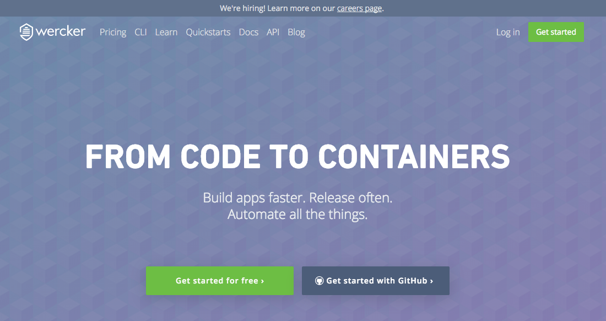
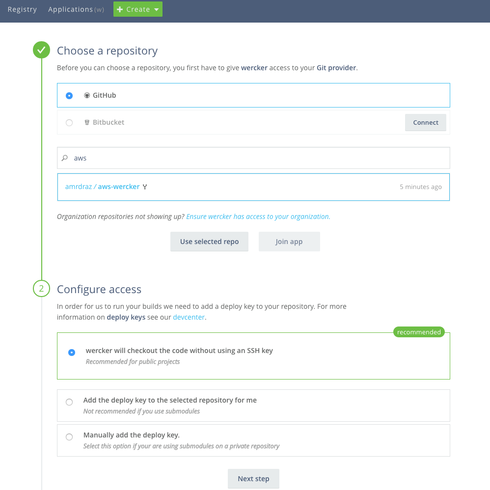
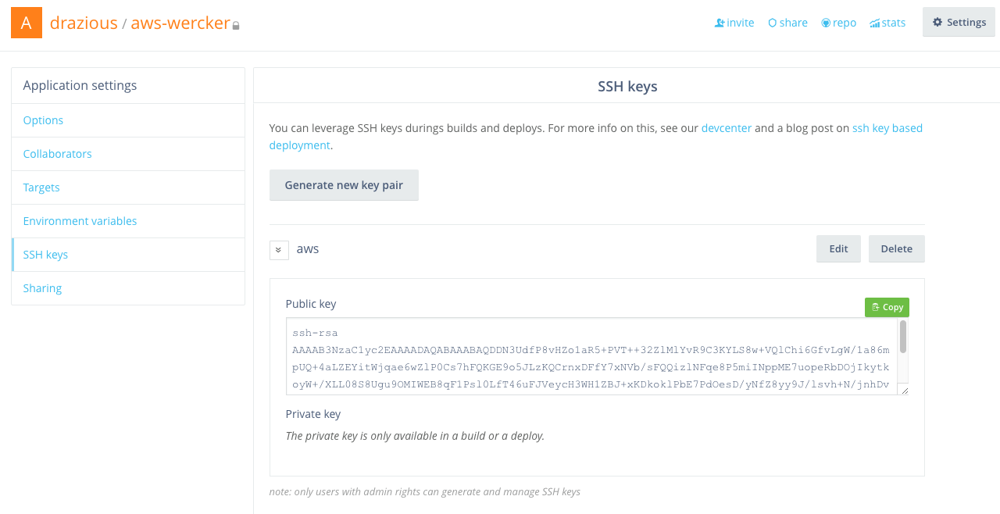
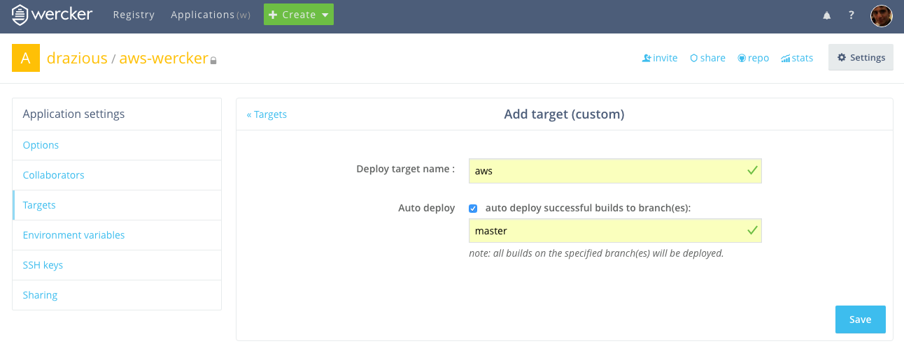
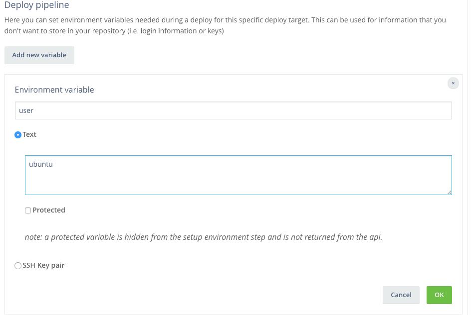

# Wercker aws CI CD example app




- Fork this repository

- Setup a wercker account and have it point to the repo you just forked



- go to the app settings and create an ssh key



- add your public key in your aws isntanc's authorized_keys file

```
$ ssh YOUR_USER@YOUR_SERVER_IP
$ vi ~/.ssh/authorized_keys
```

past the public key you got from wercker into the next line

- go back to your wercker settings and create a deployment target called aws (doesn't have to be but we will do that)



- Add variables into your target

- add the ssk key as a variable in your deployment target calling it SSH_KEY


- add the variable your HOST, your USER, your REPO_URL and the name of your APP as variables as well



You should windup with a target that looks something like this


> __Don't forget to Save__

Add `update_server.sh` file into your server's home (you already did that if you're coming from the [se-tutrial lab](https://github.com/amrdraz/se-tutorial/blob/master/lab-7.md))

This file assumes you're using nvm and pm2

```
#!/bin/bash

[[ -s $HOME/.nvm/nvm.sh ]] && . $HOME/.nvm/nvm.sh
nvm use 5.9
if [ ! -d "$APP" ]; then
   git clone "$REPO_URL" "$APP"
   cd "$APP"
else
   cd "$APP"
   git pull origin master -f
fi

npm install
cd ..
pm2 stop all
pm2 start "$APP"

exit 0
```

```
$ chmod u+x update_server.sh
```

make sure port 80 is open otherwise you should add a port variable to the script and declare it before running the app

```
sudo iptables -A INPUT -p tcp --dport 80 -j ACCEPT
sudo iptables -A OUTPUT -p tcp --dport 80 -j ACCEPT
sudo apt-get install libcap2-bin
sudo setcap cap_net_bind_service=+ep /usr/local/bin/node
```

Now your setup should be ready

To test this out simple clone this repo and change something in it (say the welcome message) then push it to master

after that checkout the app on wercker


This repo is based off of this tutorial https://botleg.com/stories/build-and-deploy-to-openshift-with-travisci-and-wercker/
and the digital ocean tutorial by wrecker http://blog.wercker.com/2013/09/03/ContinuousDelivery-with-wercker-digitalocean-and-nodejs.html

use it to figure out the missing information :D